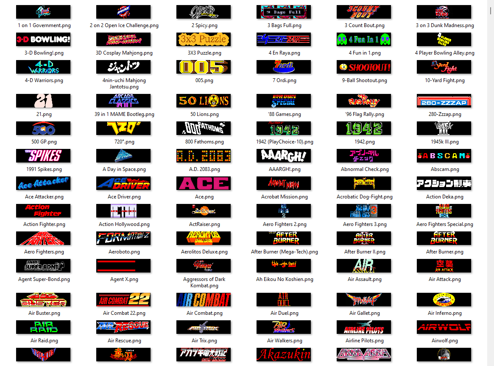
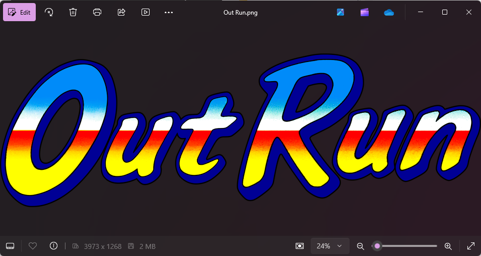
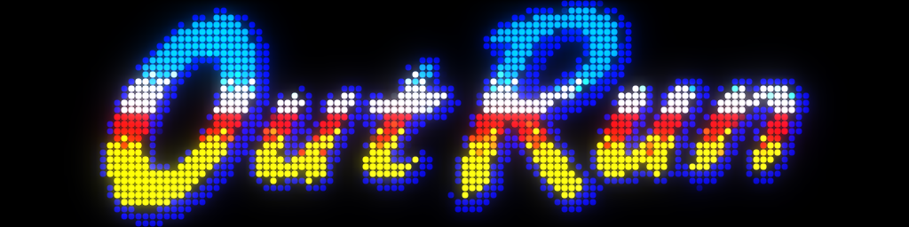
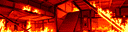
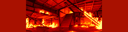
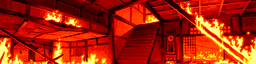

# Artwork4DMD

Artwork4DMD is a C# application that creates artwork for DMD (Dot Matrix Display) by fetching artwork from the [Launchbox Game Database](https://www.launchbox-app.com/).

This artwork can be used for example by
[DOF2DMD](https://github.com/DMDTools/DOF2DMD) to display game marquees on a
DMD.



## Converting LaunchBox Game Database Clear Logos

- Original (3973x1268 pixels)

  

- 128x32

  

- 256x64

  

## Converting local GIF images to fit or fill DMD

- Original

  

- 128x32 Fit

  

- 128x32 Fill

  

- 256x64 Fit

  

- 256x64 Fill

  


## Description

This application processes game information from Launchbox's `Metadata.xml`
file, downloads game logos, and converts them into a format suitable for use
with DMD displays. It also supports converting local GIF files to DMD-compatible
formats. It's particularly useful for arcade and retro gaming
enthusiasts who want to enhance their gaming setup with custom artwork.

## Features

For Launchbox game database:
- Parses Metadata.xml file from Launchbox Game Database
- Downloads game logos for specified platforms
- Converts images to a suitable format for DMD displays (128x32 or 256x64 or anything else, high contrast, black background, centered)
- Supports all gaming platforms from Launchbox (configurable)

For local GIF folder:
- Converts local GIF files to a suitable format for DMD displays (128x32 or 256x64 or anything else, high contrast, black background, centered)

## Prerequisites

- .NET 8 for Windows or later
- ImageMagick (for image processing)

## Configuration

The application uses a `settings.ini` file for configuration. You can specify:

- Platforms to include (`Platforms`)
- Output directory (`OutputFolder`)
- Output sizes (for 128x32 DMD and 256x64 DMD for example)
- Whether to download and convert from LaunchBox game DB (`ConvertOnlineLaunchboxGamesDB`)
- Whether to convert local GIF files (`ConvertLocalGifFiles`)
- The number of colors for GIF files
- Whether to fit the image inside the dimensions of the DMD or fill the DMD and crop

```ini
[Settings]
ConvertOnlineLaunchboxGamesDB=true
Platforms=Arcade
;Platforms=Arcade,Amstrad CPC,Commodore Amiga,Commodore 64,Atari ST
OutputFolder=.
Overwrite=false
OutputSizes=128x32,256x64
ConvertLocalGifFiles=false
LocalGifFolder=C:\path\to\your\gif\folder
GifColors=128
; GifScaleMode=fill or fit
GifScaleMode=fill
```

## Usage

1. Install .NET 8 "Runtime desktop" from Microsoft : https://dotnet.microsoft.com/en-us/download/dotnet/thank-you/runtime-desktop-8.0.6-windows-x64-installer
2. Download the binary from the [Release section](https://github.com/DMDTools/Artwork4DMD/releases)
3. Configure your `settings.ini` file with desired parameters.
4. Run the application

## Building

To build the application as a single file:

```shell
dotnet publish -r win-x64 -c Release /p:PublishSingleFile=true /p:IncludeNativeLibrariesForSelfExtract=true
```

Replace `win-x64` with your target runtime identifier if different.

## License

This program is free software; you can redistribute it and/or modify it under the terms of the GNU General Public License as published by the Free Software Foundation; either version 2 of the License, or (at your option) any later version.

## Acknowledgments

- [Launchbox Game Database](https://gamesdb.launchbox-app.com/) for providing the game metadata and artwork.
