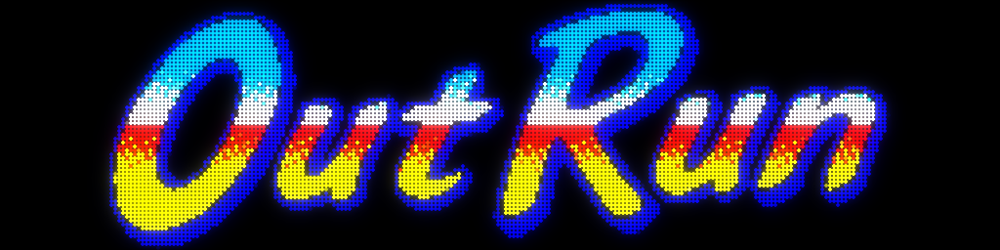

# Artwork4DMD

Artwork4DMD is a C# application for both Windows and Linux to create artwork for DMD (Dot Matrix Display) by

- Fetching artwork from the [Launchbox Game Database](https://www.launchbox-app.com/)
- Converting local GIFs to a format suitable for a DMD

This artwork can be used for example by
[DOF2DMD](https://github.com/DMDTools/DOF2DMD) to display game marquees on a
DMD.


## Converting LaunchBox Game Database Clear Logos

- Original (3973x1268 pixels)

  

- 128x32

  

- 256x64

  

## Converting local GIF images to fit or fill DMD

- Original

  

- 128x32 Fit

  

- 128x32 Fill

  

- 256x64 Fit

  

- 256x64 Fill

  

## Description

This application can process game information from Launchbox's `Metadata.xml`
file, downloads game "clear logos", and converts them into a format suitable for use
with DMD displays. It also supports converting local GIF files to DMD-compatible
formats. It's particularly useful for arcade and retro gaming
enthusiasts who want to enhance their gaming setup with custom artwork.

## Features

For Launchbox game database:

- Parses Metadata.xml file from Launchbox Game Database
- Downloads game logos for specified platforms
- Converts images to a suitable format for DMD displays (128x32 or 256x64 or anything else, high contrast, black background, centered)
- Supports all gaming platforms from Launchbox (configurable)

For local GIF folder:

- Converts local GIF files to a suitable format for DMD displays (128x32 or 256x64 or anything else, high contrast, black background, centered)

## Installation

- Windows
  1. Install .NET 8 "Runtime desktop" from Microsoft: [Download .NET 8 Runtime](https://dotnet.microsoft.com/en-us/download/dotnet/thank-you/runtime-desktop-8.0.6-windows-x64-installer)
  1. Download the Windows binary (`artwork4dmd-windows.zip`) from the [Release section](https://github.com/DMDTools/Artwork4DMD/releases)
  1. Extract the ZIP file to your desired location

- Linux
  1. Install .NET 8 for Linux:

     ```shell
     wget https://dot.net/v1/dotnet-install.sh
     chmod +x ./dotnet-install.sh
     ./dotnet-install.sh --channel 8.
     ```

  1. Download the Linux binary (`artwork4dmd-linux.zip`) from the [Release section](https://github.com/DMDTools/Artwork4DMD/releases)
  1. Extract the ZIP file: `unzip artwork4dmd-linux.zip -d artwork4dmd`

## Configuration

The application uses a `settings.ini` file for configuration. You can specify:

- Platforms to include (`Platforms`)
- Output directory (`OutputFolder`)
- Output sizes (for 128x32 DMD and 256x64 DMD for example)
- Whether to download and convert from LaunchBox game DB (`ConvertOnlineLaunchboxGamesDB`)
- Whether to convert local GIF files (`ConvertLocalGifFiles`)
- The number of colors for GIF files (`GifColors`)
- Whether to fit the image inside the dimensions of the DMD or fill the DMD and crop (`GifScaleMode=fill|fit`)
- The background color for marquees (`BackgroundColor=#000000`, defaults to black)

```ini
[Settings]
ConvertOnlineLaunchboxGamesDB=true
Platforms=Arcade
;Platforms=Arcade,Amstrad CPC,Commodore Amiga,Commodore 64,Atari ST
OutputFolder=.
Overwrite=false
OutputSizes=128x32,256x64
ConvertLocalGifFiles=false
LocalGifFolder=C:\path\to\your\gif\folder
GifColors=128
; GifScaleMode=fill or fit
GifScaleMode=fill
BackgroundColor=#000000
```

## Usage

- Windows
  - Configure your settings.ini file with desired parameters.
  - Double-click the artwork4dmd.exe file or run it from the command line: `.\artwork4dmd.exe`

- Linux
  - Configure your settings.ini file with desired parameters.
  - Make the application executable: `chmod +x artwork4dmd`
  - Run the application: `./artwork4dmd`

To display a list of all available platforms, run in a terminal:

```shell
artwork4dmd --list-platforms
```

The program will parse the Metadata.xml file and print a list of unique platform
names to the console. Add them to your settings.ini as needed.

To date, the list of available platforms are:

<details>

- 3DO Interactive Multiplayer
- Aamber Pegasus
- Acorn Archimedes
- Acorn Atom
- Acorn Electron
- Amstrad CPC
- Amstrad GX4000
- Android
- APF Imagination Machine
- Apogee BK-01
- Apple II
- Apple IIGS
- Apple iOS
- Apple Mac OS
- Arcade
- Atari 2600
- Atari 5200
- Atari 7800
- Atari 800
- Atari Jaguar
- Atari Jaguar CD
- Atari Lynx
- Atari ST
- Atari XEGS
- Bally Astrocade
- BBC Microcomputer System
- Camputers Lynx
- Casio Loopy
- Casio PV-1000
- Coleco ADAM
- ColecoVision
- Commodore 128
- Commodore 64
- Commodore Amiga
- Commodore Amiga CD32
- Commodore CDTV
- Commodore MAX Machine
- Commodore PET
- Commodore Plus 4
- Commodore VIC-20
- Dragon 32/64
- EACA EG2000 Colour Genie
- Elektronika BK
- Emerson Arcadia 2001
- Enterprise
- Entex Adventure Vision
- Epoch Game Pocket Computer
- Epoch Super Cassette Vision
- Exelvision EXL 100
- Exidy Sorcerer
- Fairchild Channel F
- Fujitsu FM Towns Marty
- Fujitsu FM-7
- Funtech Super Acan
- Game Wave Family Entertainment System
- GamePark GP32
- GameWave
- GCE Vectrex
- Hartung Game Master
- Hector HRX
- Interton VC 4000
- Jupiter Ace
- Linux
- Magnavox Odyssey
- Magnavox Odyssey 2
- Matra and Hachette Alice
- Mattel Aquarius
- Mattel HyperScan
- Mattel Intellivision
- Mega Duck
- Memotech MTX512
- Microsoft MSX
- Microsoft MSX2
- Microsoft MSX2+
- Microsoft Xbox
- Microsoft Xbox 360
- Microsoft Xbox One
- Microsoft Xbox Series X/S
- MS-DOS
- MUGEN
- Namco System 22
- NEC PC-8801
- NEC PC-9801
- NEC PC-FX
- NEC TurboGrafx-16
- NEC TurboGrafx-CD
- Nintendo 3DS
- Nintendo 64
- Nintendo 64DD
- Nintendo DS
- Nintendo Entertainment System
- Nintendo Famicom Disk System
- Nintendo Game & Watch
- Nintendo Game Boy
- Nintendo Game Boy Advance
- Nintendo Game Boy Color
- Nintendo GameCube
- Nintendo Pokemon Mini
- Nintendo Satellaview
- Nintendo Switch
- Nintendo Virtual Boy
- Nintendo Wii
- Nintendo Wii U
- Nokia N-Gage
- Nuon
- OpenBOR
- Oric Atmos
- Othello Multivision
- Ouya
- PC Engine SuperGrafx
- Philips CD-i
- Philips VG 5000
- Philips Videopac+
- PICO-8
- Pinball
- RCA Studio II
- SAM Coupé
- Sammy Atomiswave
- ScummVM
- Sega 32X
- Sega CD
- Sega CD 32X
- Sega Dreamcast
- Sega Dreamcast VMU
- Sega Game Gear
- Sega Genesis
- Sega Hikaru
- Sega Master System
- Sega Model 1
- Sega Model 2
- Sega Model 3
- Sega Naomi
- Sega Naomi 2
- Sega Pico
- Sega Saturn
- Sega SC-3000
- Sega SG-1000
- Sega ST-V
- Sega System 16
- Sega System 32
- Sega Triforce
- Sharp MZ-2500
- Sharp X1
- Sharp X68000
- Sinclair ZX Spectrum
- Sinclair ZX-81
- SNK Neo Geo AES
- SNK Neo Geo CD
- SNK Neo Geo MVS
- SNK Neo Geo Pocket
- SNK Neo Geo Pocket Color
- Sony Playstation
- Sony Playstation 2
- Sony Playstation 3
- Sony Playstation 4
- Sony Playstation 5
- Sony Playstation Vita
- Sony PocketStation
- Sony PSP
- Sony PSP Minis
- Sord M5
- Spectravideo
- Super Nintendo Entertainment System
- Taito Type X
- Tandy TRS-80
- Tapwave Zodiac
- Texas Instruments TI 99/4A
- Tiger Game.com
- Tomy Tutor
- TRS-80 Color Computer
- Vector-06C
- VTech CreatiVision
- VTech Socrates
- VTech V.Smile
- Watara Supervision
- Web Browser
- Windows
- Windows 3.X
- WonderSwan
- WonderSwan Color
- WoW Action Max
- XaviXPORT
- ZiNc

</details>

## Building

To build the application as a single file:

- Windows

  ```shell
  dotnet publish -r win-x64 -c Release /p:PublishSingleFile=true /p:IncludeNativeLibrariesForSelfExtract=true
  ```

- Linux

  ```shell
  dotnet publish -r linux-x64 -c Release /p:PublishSingleFile=true /p:IncludeNativeLibrariesForSelfExtract=true
  ```

## License

This program is free software; you can redistribute it and/or modify it under the terms of the GNU General Public License as published by the Free Software Foundation; either version 2 of the License, or (at your option) any later version.

## Acknowledgments

- [Launchbox Game Database](https://gamesdb.launchbox-app.com/) for providing the game metadata and artwork.
